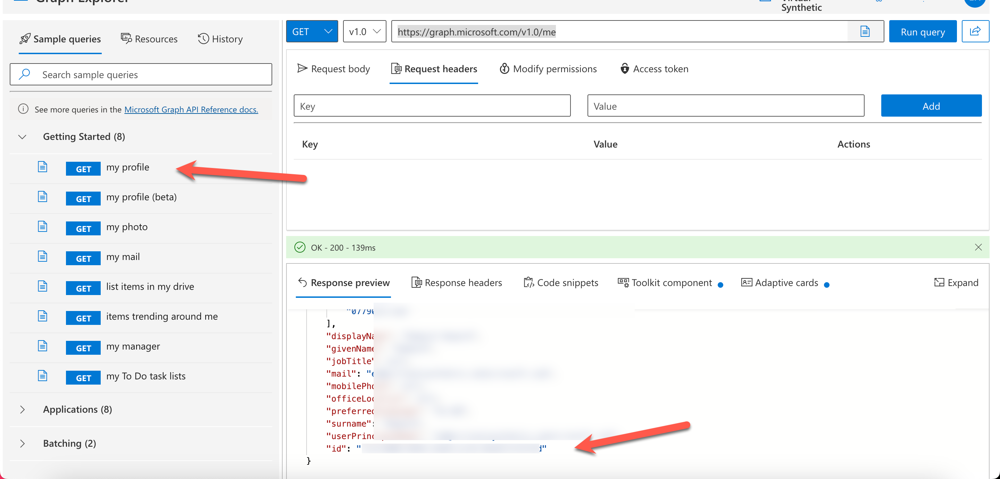
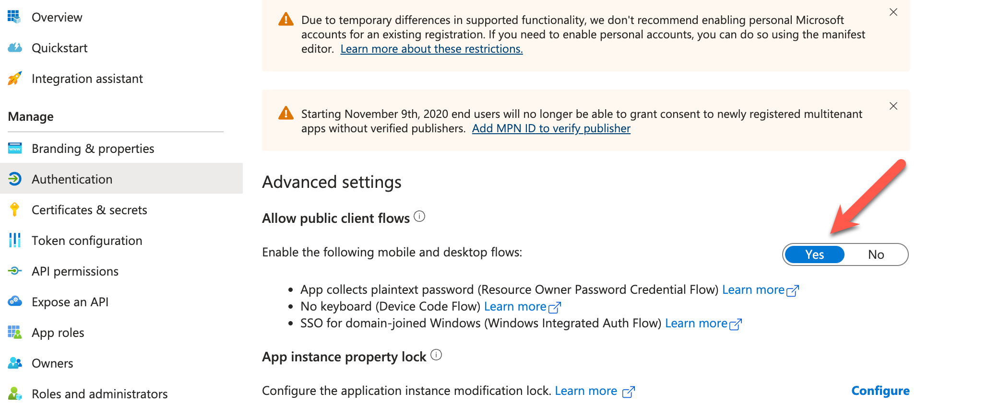

# VB365 Global Exchange Search

This script is a proof of concept to show how you can use the Veeam Backup for Office 365 REST API to search for emails in a global search.

You can view the Veeam documentation on how this works:

https://helpcenter.veeam.com/docs/vbo365/rest/search.html?ver=70

## Configuration file

A configuration.toml file is required:

```toml
[microsoft]
tenant_id = ""
application_id = ""
user_id = ""

[vb365]
api_address = "192.168.0.123"
username = "user@test.com"
password = "password"
```

### Tenant ID

You can get the tenant_id from the Azure portal, under:

Azure Active Directory -> Tenant ID

### Application ID

The Application is the ID of the VB365 application you created in Azure AD. 

Azure Active Directory -> App Registrations -> "App Name" -> Application (client) ID

### User ID

The user_id is a bit more tricky, you can get it using the Veeam Guide:

https://helpcenter.veeam.com/docs/vbo365/rest/authorization_restore_operator.html?ver=70#ids

But I have found it easier to use the Grpah API Explorer: 

https://developer.microsoft.com/en-us/graph/graph-explorer

Login with account you will use for restores and then run the first query shown "GET my profile" and look for the "id" field.



## Azure AD Application

You will need to modify the Azure AD Application to allow for this change:



## Dependencies

You will need to install the following modules:

- requests
- fire
- pyperclip
- halo

```
pip install requests fire pyperclip halo
```

## Usage

There are two cli options (currently):

- login
- search
- logout

### Login

This will take you through the whole process of logging in (see Veeam docs for full process). 

During the login it will prompt you to paste the user code into the web browser and then authenthicate with the same user account you used for the user_id in the config file.

Once compleleted there will be three files created:

- restore_header.json - This is the header file used for the search
- restore.json - This contains the details of the restore session
- standard_headers.json - This is the standard headers used for all requests (except the search)

The tool also logs you into the VB365 API the normal way and save it to the "standard_headers.json" file. It isn't used at the moment, but maybe in the future.

### Search

This will search the VB365 backups for emails based on the query string.

The query string details can be found in the documentation, but they are fairly straight forward.

See the bottom of: https://helpcenter.veeam.com/docs/vbo365/rest/search.html?ver=70

And: https://helpcenter.veeam.com/docs/vbo365/rest/appendix_search.html?ver=70

There are also a couple of optional parameters:

- limit - This will limit the number of results returned (default is 30, max is 10000)
- print_results - This will print the results to the screen (default is False)

### Logout

You can stop the restore session by using the "logout" command.

## Examples

### Login

```
python search.py login
```

### Search

```
python search.py search --query "subject: Test" --limit 100 --print_results
```

Each time it runs the results will be saved to a json file called "results-timestamp.json".

### Logout

```
python search.py logout
```

